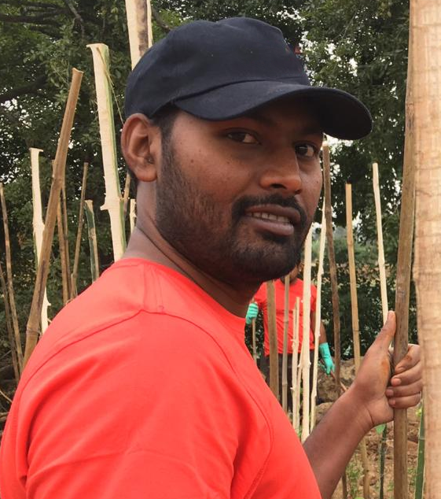

---
hide:
  - toc
  - navigation
---

# Home

Hey! I'm **<a href="https://twitter.com/jaganbathri" target="_blank">@jaganbathri</a> (Jaganthan Bantheswaran)**. 👋

You are probably looking for my **<a href="https://dhuruvah.in/projects/">open source projects</a>**.

I'm a software developer from India.

I currently live in Salem, Tamilnadu, India.

I created **<a href="https://ndastro-engine.dhuruvah.in" target="_blank">NDAstro Engine</a>** 🚀

I have been building UI, APIs and tools for Web app and data systems, in India, with different teams and organizations. 🌎

I'm now working full time for Itron, Inc. 🤓

Credits: @tiangolo
